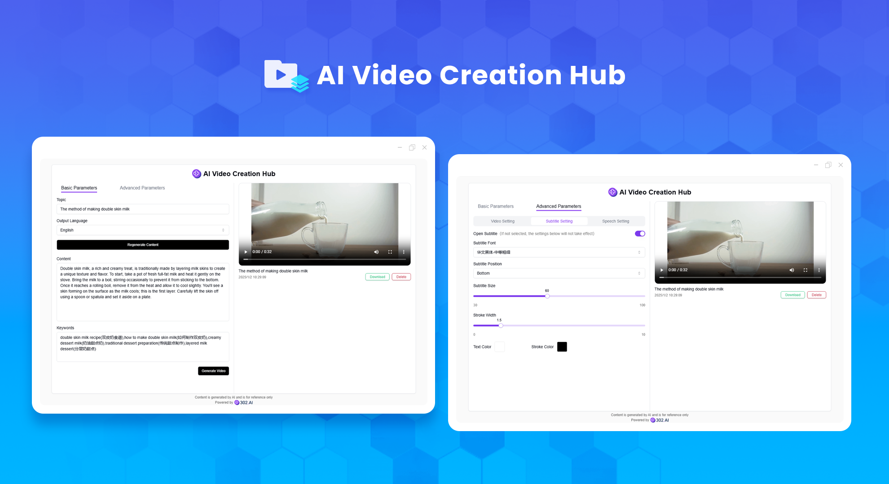
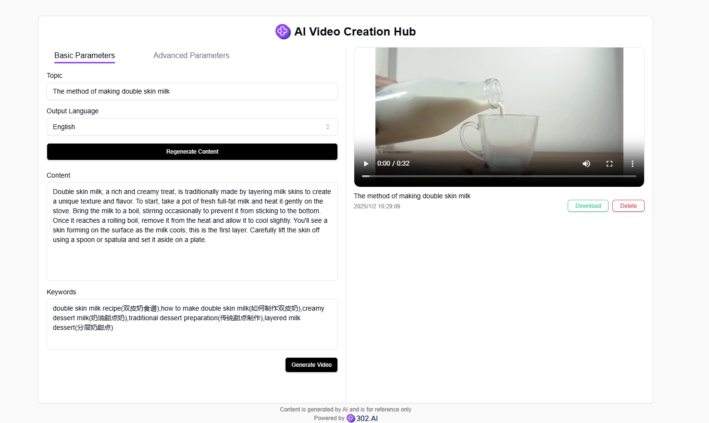
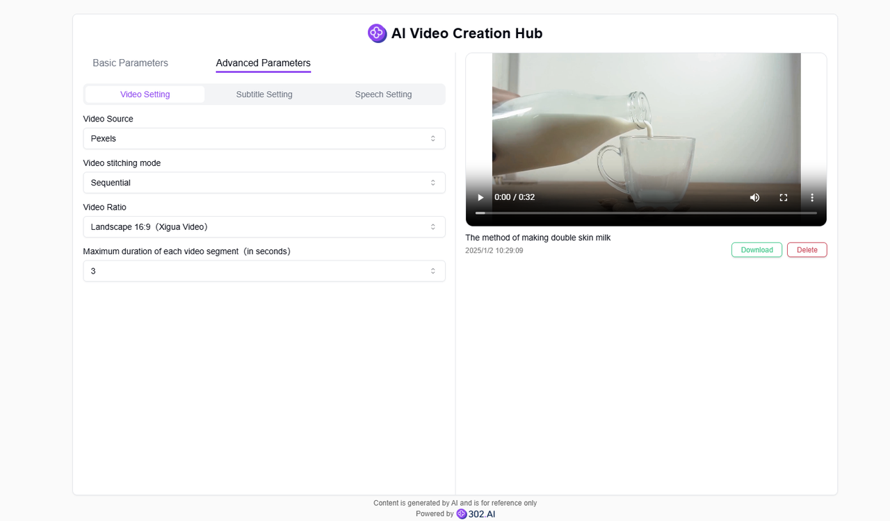
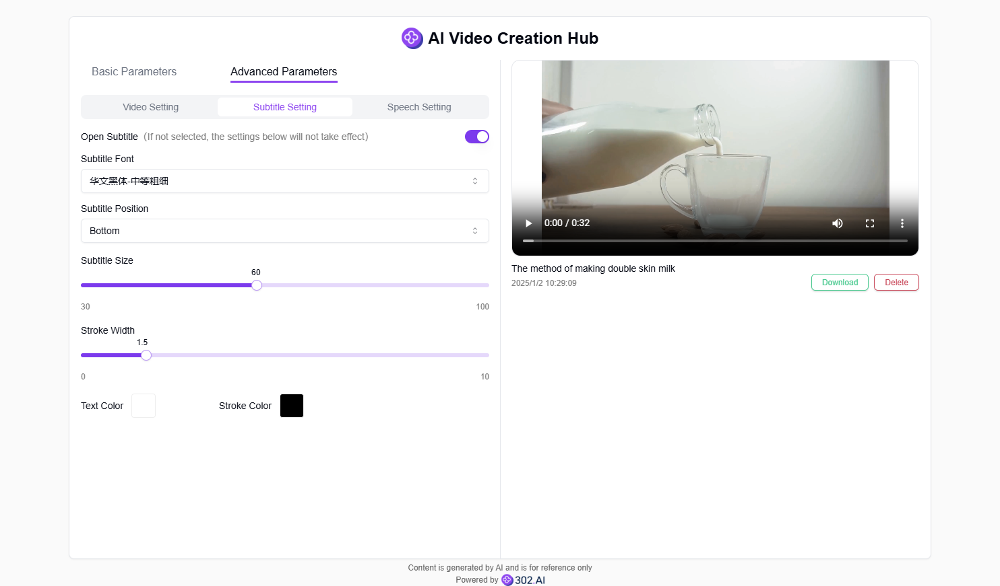
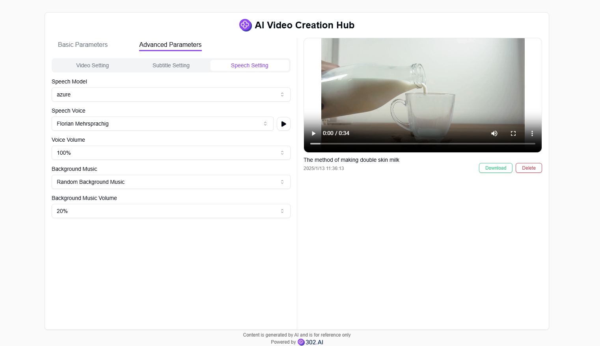

# <p align="center"> 🔍 AI Video Creation Hub 🚀✨</p>

<p align="center">The AI Video Material Creative Station generates high-quality copy and keywords by combining AI large language models based on the theme information provided by users. It combines and assembles various video materials according to this information, and can also include subtitles and background music.</p>

<p align="center"><a href="https://302.ai/product/detail/20" target="blank"></a></p >

<p align="center"><a href="README_zh.md">中文</a> | <a href="README.md">English</a> | <a href="README_ja.md">日本語</a></p>



This is the open-source version of the [AI Video Creation Hub](https://302.ai/product/detail/20) from [302.AI](https://302.ai/en/). You can directly log in to 302.AI to use the online version with zero code and zero background, or modify and deploy it yourself according to your requirements.


## Interface Preview
Enter the theme of the video, set the language of the video content, choose to input and edit the copy content in the video and set the video keywords by yourself, or choose AI to automatically generate copy and keywords based on the theme. Finally, creative videos can be generated based on the specified theme, copy, and keywords.


Additional settings can be made for video generation in advanced parameters, such as video segment source, proportion, and maximum duration for each segment to be accessed.
     

Subtitle styles can be set, such as size, position, stroke thickness, font, and color.
     

You can also set the dubbing settings in the video, select different voice packs and listen to them, and choose to add random background music.
   


## Project Features
### ✒️ AI One-Click Generation of Video Copy and Keywords
  After setting the video theme and language, users can generate them with one click. Users can make modifications based on the generated content.
### 🎧 Customizable Video Dubbing
  Users can choose different voice models to dub the video subtitles. They can also generate background music randomly.
### 📹 Customizable Video and Subtitle Generation
  Users can independently select the source of video clips and the aspect ratio. They can also customize subtitle settings.
### 📎 Video Download
  Users can download the generated creative videos to their local devices.
### 🌓 Dark Mode
  It supports dark mode to protect your eyes.
### 🌍 Multi-language Support
- Chinese Interface
- English Interface
- Japanese Interface
## 🚩 Future Update Plans
- [ ] Add more voice options
- [ ] Support for uploading audio files as background music


## 🛠️ Tech Stack

- **Framework**: Next.js 14
- **Language**: TypeScript
- **Styling**: TailwindCSS
- **UI Components**: Radix UI
- **State Management**: Jotai
- **Form Handling**: React Hook Form
- **HTTP Client**: ky
- **i18n**: next-intl
- **Theming**: next-themes
- **Code Standards**: ESLint, Prettier
- **Commit Standards**: Husky, Commitlint


## Development & Deployment
1. Clone the project
```bash
git clone https://github.com/302ai/302_video_creation_hub
cd 302_video_creation_hub
```

2. Install dependencies
```bash
pnpm install
```

3. Configure environment
```bash
cp .env.example .env.local
```
Modify the environment variables in `.env.local` as needed.

4. Start development server
```bash
pnpm dev
```

5. Build for production
```bash
pnpm build
pnpm start
```


## ✨ About 302.AI ✨
[302.AI](https://302.ai) is an enterprise-oriented AI application platform that offers pay-as-you-go services, ready-to-use solutions, and an open-source ecosystem.✨
1. 🧠 Comprehensive AI capabilities: Incorporates the latest in language, image, audio, and video models from leading AI brands.
2. 🚀 Advanced application development: We build genuine AI products, not just simple chatbots.
3. 💰 No monthly fees: All features are pay-per-use, fully accessible, ensuring low entry barriers with high potential.
4. 🛠 Powerful admin dashboard: Designed for teams and SMEs - managed by one, used by many.
5. 🔗 API access for all AI features: All tools are open-source and customizable (in progress).
6. 💡 Powerful development team: Launching 2-3 new applications weekly with daily product updates. Interested developers are welcome to contact us.
