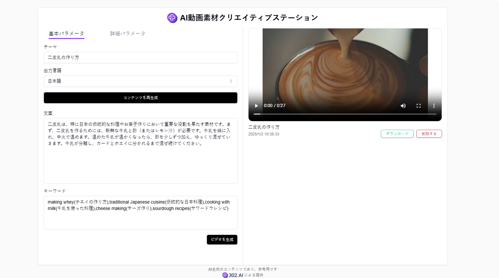
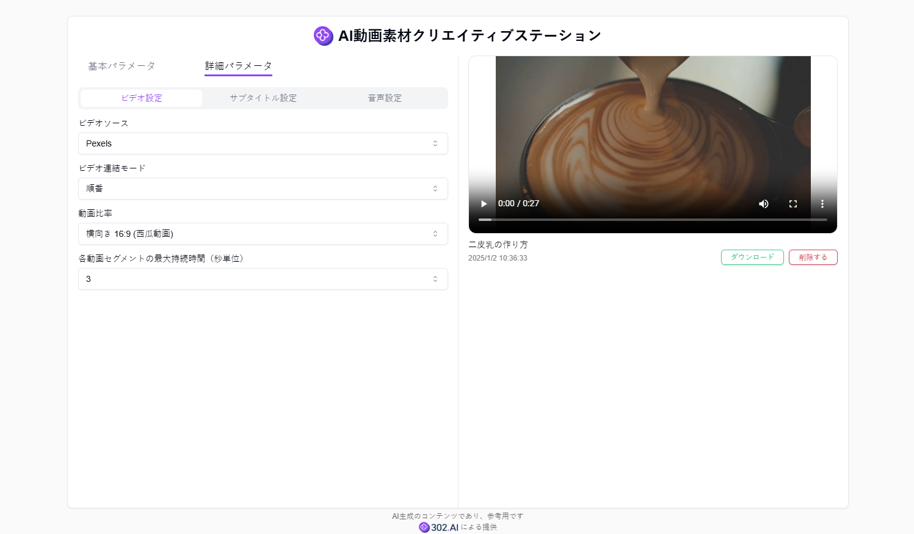
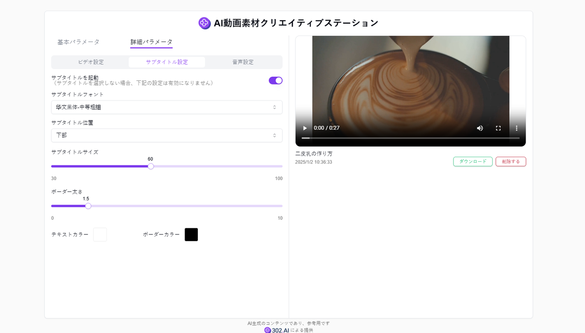
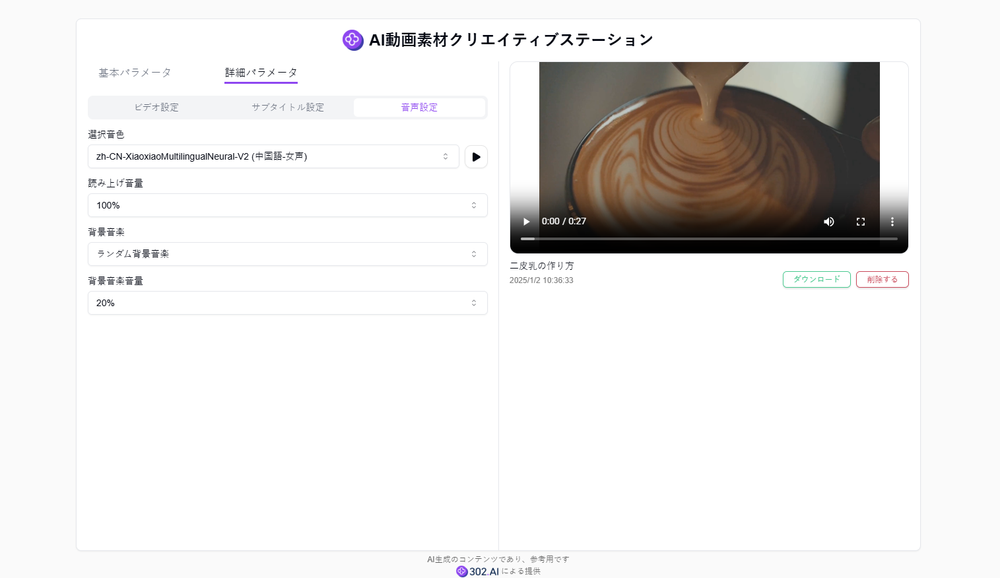

# <p align="center"> 🔍 AI 動画素材クリエイティブステーション 🚀✨</p>

<p align="center">AI ビデオ素材クリエイティブステーションは、ユーザーが提供するテーマ情報を元に、AI の大規模言語モデルを組み合わせて、高品質のコピーとキーワードを生成します。これらの情報に基づいて、さまざまなビデオ素材を組み合わせ、編集し、字幕や背景音楽も付けることができます。</p>

<p align="center"><a href="https://302.ai/ja/tools/video/" target="blank"></a></p >

<p align="center"><a href="README_zh.md">中文</a> | <a href="README.md">English</a> | <a href="README_ja.md">日本語</a></p>


[302.AI](https://302.ai)の[AI 動画素材クリエイティブステーション](https://302.ai/ja/tools/video/)のオープンソース版です。
302.AIに直接ログインすることで、コード不要、設定不要のオンライン体験が可能です。
あるいは、このプロジェクトをニーズに合わせてカスタマイズし、302.AIのAPI KEYを統合して、自身でデプロイすることもできます。

## インターフェースプレビュー
ビデオのテーマを入力し、ビデオコンテンツの言語を設定し、ビデオ中のファイルコンテンツを自分で入力編集し、ビデオキーワードを自分で設定するか、AIを選択してテーマに基づいてファイルとキーワードを自動生成することができる。最後に、指定されたテーマ、文案、キーワードに基づいてアイデアビデオを生成することができます。


ビデオクリップのソース、スケール、各クリップアクセスの最大時間など、高度なパラメータでビデオ生成のためにさらに設定することができます。


字幕スタイル（サイズ、位置、線の太さ、フォント、色など）を設定できます。
     

ビデオ内のダビング設定、異なる音声パッケージを選択して試聴することもでき、ランダムな背景音楽を追加することもできます。
   


## プロジェクトの特徴
### ✒️ AI によるビデオコピーとキーワードの一括生成
  ビデオのテーマと言語を設定した後、1 クリックで生成できます。ユーザーは生成された内容を元に修正することができます。
### 🎧 カスタマイズ可能なビデオ吹き替え
  ユーザーはさまざまなボイスモデルを選択してビデオの字幕に吹き替えを行うことができます。また、ランダムに背景音楽を生成することもできます。
### 📹 カスタマイズ可能なビデオと字幕の生成
  ユーザーはビデオクリップのソースとアスペクト比を独自に選択することができます。また、字幕の設定もカスタマイズできます。
### 📎 ビデオのダウンロード
  生成されたクリエイティブなビデオをローカルデバイスにダウンロードできます。
### 🌓 ダークモード
  ダークモードをサポートしており、あなたの目を保護します。
### 🌍 多言語サポート
- 中国語インターフェース
- 英語インターフェース
- 日本語インターフェース

## 🚩 将来のアップデート計画
- [ ] さらに多くの音色オプションを追加する
- [ ] 背景音楽としてオーディオファイルのアップロードをサポートする


## 🛠️ 技術スタック

- **フレームワーク**: Next.js 14
- **言語**: TypeScript
- **スタイリング**: TailwindCSS
- **UIコンポーネント**: Radix UI
- **状態管理**: Jotai
- **フォーム処理**: React Hook Form
- **HTTPクライアント**: ky
- **国際化**: next-intl
- **テーマ**: next-themes
- **コード規約**: ESLint, Prettier
- **コミット規約**: Husky, Commitlint


## 開発&デプロイ
1. プロジェクトのクローン
```bash
git clone https://github.com/302ai/302_video_creation_hub
cd 302_video_creation_hub
```

2. 依存関係のインストール
```bash
pnpm install
```

3. 環境設定
```bash
cp .env.example .env.local
```
必要に応じて`.env.local`の環境変数を修正してください。

4. 開発サーバーの起動
```bash
pnpm dev
```

5. プロダクションビルド
```bash
pnpm build
pnpm start
```

## ✨ 302.AIについて ✨
[302.AI](https://302.ai)は企業向けのAIアプリケーションプラットフォームであり、必要に応じて支払い、すぐに使用できるオープンソースのエコシステムです。✨
1. 🧠 包括的なAI機能：主要AIブランドの最新の言語、画像、音声、ビデオモデルを統合。
2. 🚀 高度なアプリケーション開発：単なるシンプルなチャットボットではなく、本格的なAI製品を構築。
3. 💰 月額料金なし：すべての機能が従量制で、完全にアクセス可能。低い参入障壁と高い可能性を確保。
4. 🛠 強力な管理ダッシュボード：チームやSME向けに設計 - 一人で管理し、多くの人が使用可能。
5. 🔗 すべてのAI機能へのAPIアクセス：すべてのツールはオープンソースでカスタマイズ可能（進行中）。
6. 💪 強力な開発チーム：大規模で高度なスキルを持つ開発者集団。毎週2-3の新しいアプリケーションをリリースし、毎日製品更新を行っています。才能ある開発者の参加を歓迎します。
